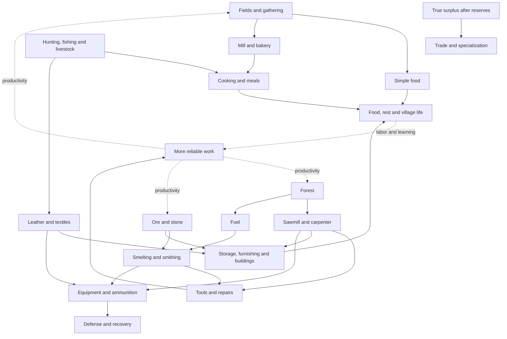

# Hearthstead — post-demo design and development plan

## Current owner authority — 16 September 2026

First repair and verify the existing connected six-role gameplay, emphasizing
workers, motion and Tavern. After that gate, Tobias now authorizes execution of
the existing long-term plan and fitting reversible ideas in small complete
slices. This supersedes historical text requiring a separate start request for
every future named phase. All production/crafts, defense/enemy and village-life/
trade strands remain desired; sequence them by dependency and player benefit.
Goblin theft, trade visits, non-lethal disputes/suspicious visitors and traveler
requests are selected directions, not a simultaneous feature dump or completed
systems. Grounded medieval life remains primary; fantasy/humor is restrained.
The accepted answers in MECHANICS_DECISIONS_2026-09-07.md and the binding
QUALITY_STANDARD.md / JOB_STANDARD.md control implementation and acceptance.
Historical dates below are not current delivery promises.

Status: FORWARD PLAN, updated 6 September 2026. Owner: Tobias. Maintainer: the active project lead. Individual phase status distinguishes authorized work from future proposals; this document is not implementation evidence.

## Current decision layer — 6 September evening

The personal demo target is **Monday 7 September at 20:00 Europe/Oslo**. Its
timed work and acceptance live in [ROADMAP.md](ROADMAP.md). The owner requests
long-term design now so the demo preserves useful foundations. Preserve the
six trades and dedicated Mayor; no new profession/chain expands that deadline.
The Mayor is leadership support, not another interchangeable trade.

The following decisions supersede older passages and historical economy notes:

- **One physical currency, displayed as Coins.** Reuse the existing registered
  currency item and supplied gold-coin design. Coins have an actual inventory
  location; a warehouse treasury compartment is the preferred proposed storage
  UI, not a second balance that can diverge from its inventory.
- **Income and spending:** merchant purchases of real village output, bounded
  raid rewards and visitors buying actual Tavern service fund recruitment,
  trade and useful plans/job unlocks. Premium recruits cost more. Exact prices,
  reward rates and storage details are tuning work, not completed decisions.
- **Trade authority:** manual trade first; a future employed Trader prepares
  proposed deals and Courier supplies goods. The player approves each deal.
  Automating transport/preparation does not authorize automatic approval.
  Visiting merchants mainly want produced goods, plus attainable stretch demand.
- **Quality:** player-made output is the lowest grade; village production can
  produce higher grades and earn higher prices. Do not add a hidden village-only
  sale prohibition, extra currency or a purely cosmetic provenance label.
  Higher-grade progression needs real labor/skill/input consumers and visible
  benefit; it cannot be a rename operation on an existing stack.
- **Demand:** repeated sales of the same product reduce its price within clear
  bounds. Protect essential food, seeds, replacement tools and ammunition from
  trading. Define recovery windows and merchant stock explicitly; loading a
  world again must not refresh exploitable demand or duplicate offers.
- **Tavern:** real seated service, greeting, light humming and table handling
  are demo work. Paid visitors, richer meals and brewing are distinct additions
  with actual consumption/payment accounting. No fake ale prop counts as a
  delivered beer transaction. A visitor remains a visitor until paid recruitment
  and a valid exclusive bed are committed.
- **Combat and housing:** preserve strong Guards, wooden starter swords,
  purposeful defense, civilian flight and food-based recovery. Capacity derives
  from real valid beds. Yellow means valid/free; green means valid/assigned,
  including daytime. Persistent occupancy must govern allocation as well as UI.
- **Presentation:** complete current motion, audio and readability repairs now.
  ALL active UI redesign is now explicitly required for tomorrow's demo. Optional installed
  minimap/shader conveniences do not require building an economic map.

The latest evening instruction explicitly adds a functional physical
Coins/quality/manual-merchant/paid-visitor economy to tomorrow's survival demo,
including reachable early earnings. Real two-player shared play is also demo
scope. Earlier deferrals below are superseded for those requirements; future
Trader automation, broader management systems and additional production
families remain later phases. Implementation and acceptance are still pending.

### Long-term delivery order and exit checks

These are dependency milestones, not promised calendar durations. Re-estimate
the next milestone after observing the demo and measuring actual work.

| Milestone | Useful result | Exit check before expanding |
|---|---|---|
| D: tomorrow's demo | One satisfying village day and understandable defense with all six roles | Current demo acceptance in ROADMAP; exact candidate, motion/audio, physical work, save/load and an honest defect list |
| S: stabilization and friend test | The same settlement works for two friends, then the requested 2–4-player scenario | Shared recruitment, last-bed/last-item contention, permissions, disconnect/rejoin and active work survive; no item/Coins duplication or save corruption |
| E: Coins and quality economy | Produce, store, deliver, approve a trade, receive physical Coins, recruit or unlock something useful, then invest in better output | One complete repeatable income/spending loop; immutable quote, protected stock, full treasury, cancel/reload, quality metadata, supply/demand and paid Tavern service tested |
| P1: first useful production family | One selected refinement creates a real advantage with labor/space/transport tradeoffs | Equal-start comparison against the simple route, useful final consumer, safe shortage/full-output/reload recovery; flour/bread is a candidate, not a preselected expansion |
| P2: sustainable equipment | Workers replenish tools; defense replenishes weapons/ammunition through actual supported recipes | Exact multi-input accounting, durability, fuel/byproducts and affordable bootstrap/recovery; no circular deadlock requiring an unavailable tool |
| P3: better management and identity | Clear workplace/group controls, understandable bottlenecks, meaningful traits/training, richer food and furnishing | Player can identify and fix the dominant delay; optional depth improves outcomes without compulsory micromanagement; complete UI/motion/audio review |
| P4: measured defense and scale | Preparation, positioning and supplies matter against stronger natural raids | Tested warning/recovery/defeat cycle, no arbitrary player invulnerability assumptions, measured active 50–100-citizen work with 2–4 clients and published machine/settings |
| R: public release candidate | Other players can install, learn, save and continue the mod | Clean install, supported survival progression, migration/rollback, licensed assets, dependency compatibility, release notes and fullx2 + gate + exact native release-client-gate; publishing still needs explicit authorization |

Minimum performance measurement starts in S and continues per milestone; P4
deepens capacity evidence rather than postponing performance until the end.
Art, sound and readable UI ship with each system. P3 is the larger management
redesign, not permission to ship illegible earlier phases. Branches such as
textiles, livestock, regional factions and expeditions remain the planned
network below; none earns priority merely because a recipe entry already exists.

For every phase, record one small example the player can try, the useful output,
its complete acquisition/consumption path, the physical owner at each step,
failure/recovery behavior, and the specific observation proving its value.
Complete that slice before adding another profession or resource tier.

### Early Guard usefulness — selected direction, implementation queued

The owner requests thieves or residents arguing so Guards matter before large
raids. The preferred first small slice is **an occasional detectable theft
attempt**, after core defense is reliable. This is new requested design, not an
implemented incident system or a silent enlargement of tomorrow's demo.

The proposed play is readable: a visitor behaves suspiciously near accessible
stock, a witness or Guard raises a local alert, and an available Guard goes to
intercept. Use the same threat/response/return-to-duty system as other defense.
Keep the first version sparse and recoverable. An ordinary guest is never
treated as hostile merely for being a visitor, and a minor dispute should not
automatically cause lethal sword combat.

Any stolen goods must move from real accessible stock to one actual carried
inventory and remain recoverable. No arbitrary subtraction from a village
balance, fake reimbursement, unavoidable newcomer punishment or guaranteed
loss without a readable warning/response window. Define what happens on escape,
death, capture, interruption and reload before allowing valuable theft.
The player retains a manual response; a Guard offers safety and less attention
spent policing rather than being an artificial first-minute tax.

Exit check: one actual attempt, civilian notice, Guard interception, accounted
goods and return to duty, plus a harmless visitor false-positive case and a
save/reload case. Then evaluate whether resident disputes add a distinct useful
decision; if selected, start with non-lethal separation/de-escalation rather
than adding another battle generator. Exact rates and penalties are undecided.

### Low-pressure village moments — selected direction, implementation queued

The settlement should gain depth from small, optional scenes that grow out of
real work, meals, rest, arriving residents and ordinary visitors. They are not
quests, a random-disaster system, or a social-management minigame. A player
should be able to notice a moment, stay to watch it, or continue building and
exploring with no penalty, missed reward or urgent prompt. This direction is
selected by Tobias on 20 September 2026; it is not implemented gameplay.

The first catalogue is deliberately grounded and small:

| Moment | Visible play | Lasting detail |
|---|---|---|
| New neighbour | A newly hired resident is met at a real home or joins their first meal. | Their first welcome is remembered by the resident and host. |
| Work companions | Two compatible residents share a scheduled meal, walk a short stretch together after work, or exchange a brief line by the well. | A small bounded familiarity record makes later encounters recognisable. |
| Pride in work | A resident briefly shows a genuinely notable result: a good catch, a full delivery or completion of a difficult repair. | The line refers to the real completed work, never a fabricated counter. |
| Familiar visitor | A returning guest recognises the Tavern, a resident or their usual table. | A few distinct return visits reveal a small personal history. |
| Tavern story | An eligible guest tells a short local or regional story while people who are already free choose to listen. | The world feels larger without a new quest chain or required dialogue. |
| Quiet aftermath | After a resolved raid or major village milestone, free residents briefly acknowledge what happened. | Recovery and achievement leave a human trace, without creating new pressure. |

These moments use existing places and scheduled idle time. Work, food, sleep,
orders, pathing, bed claims, Tavern service and defense always win. Participants
may begin only after a safe work boundary; a Guard on duty, a resident with a
critical need, someone carrying committed cargo, or anyone responding to danger
is ineligible. A threat, shortage, route failure or player order ends the scene
cleanly and returns each participant to their ordinary behaviour. The system
must never reserve a door, chair, storage contact, work target or path corridor
in a way that blocks ordinary play.

Use sparse local scheduling: at most one visible village moment at a time per
loaded settlement, with a long context-sensitive cooldown and no catch-up burst
after reload, sleep or a period away from the settlement. Do not load chunks,
pull players to an event, open a screen, add a map marker or post repeated chat
messages. Short ambient dialogue and readable body language are enough. A scene
is cancelled harmlessly if a participant or its location is unavailable.

Memory is intentionally narrow. Persist only the few facts that make a return
visit or friendship feel continuous: a capped familiarity relation, a completed
welcome, and a small per-visitor story stage. It must survive save/reload and
multiplayer without duplicating an event, visitor, item, Coin, or relationship
advance. Do not turn this into a global relationship graph, a morale score or
another resource the player has to optimise.

No village moment creates a mandatory Coin source, Coin sink, item loss, job
gate or combat encounter. The separate traveler-request and trade systems may
offer a clear voluntary transaction later, but their offers must still follow
the physical economy and conservation rules. A suspicious visitor or theft
attempt remains the distinct early Guard slice above; it must not run alongside
an ambient moment or make ordinary guests look dangerous.

First implementation order after the connected core loop is accepted:

1. **New neighbour** and **work companions**, because they reuse resident,
   home, meal and idle behaviour with no visitor economy or combat dependency.
2. **Familiar visitor** and **Tavern story**, after ordinary visitor seating,
   service, return cadence and save/reload are reliable.
3. **Pride in work** and **quiet aftermath**, after each triggering work result
   and the raid-recovery state can be read truthfully.
4. Keep theft/interception and voluntary traveler requests as separate complete
   slices with their existing ownership, warning and economic acceptance rules.

Do not begin with a travelling musician, festival calendar, family simulation
or broad faction reputation. Those can be revisited in P5 only if the smaller
moments remain sparse, legible and enjoyable in ordinary play; none is needed
to make the village feel alive.

Exit evidence for the first slice: observe a scene starting and ending during
normal play; prove that work throughput, guard response, delivery ownership and
Tavern seating remain correct when it is ignored or interrupted; verify no
event pile-up after save/reload or co-op rejoin; and compare representative
settlement performance with the feature disabled. Automated state checks alone
do not prove that the scene feels natural.

## 1. Purpose and authority

Build the current demo so it can grow into a deep settlement game without making that demo carry the cost of every future feature. The immediate priority is a playable, understandable village with reliable workers, physical logistics and satisfying defense. This document plans the expansion; it does not start it or enlarge the demo's acceptance scope.

Tobias explicitly deferred the four additional demo production-chain proposals on 5 September, then requested a complete forward plan. That means **plan the chains now; implement them after the demo when their named phase is started**. The later evening instruction brings ALL active UI and the functional Coins economy into the current demo. Existing supported features and old saves still require maintenance.

This is the main forward-looking design document. [ROADMAP.md](ROADMAP.md) remains the current delivery and coverage record; [CURRENT_TASK.md](../../PROJECT_STATE/CURRENT_TASK.md) owns live work; [HEARTHSTEAD_QUALITY_LEDGER.md](../../hearthstead-neoforge/docs/HEARTHSTEAD_QUALITY_LEDGER.md) owns verification. Older PLAN_CHAINS, PLAN_PRODUCTION_CHAINS, PLAN_WORK_AND_CHAINS, FLOWS and DESIGN documents are design history where they conflict with newer owner decisions or this plan. Do not treat their old completion, language, platform, timing or recipe claims as current evidence.

Labels used below:

- **SOURCE:** inspected implementation exists; this does not establish a complete survival route or acceptable gameplay.
- **VERIFIED SLICE:** bounded runtime evidence exists, with its limits stated.
- **PROPOSED:** intended future behavior, not implementation or release approval.
- **DEFERRED:** outside the current demo additions. A proposal here is not a deadline commitment.

The plan covers the known vision and gives new ideas a place. It cannot anticipate every future idea Tobias has not yet described. Revisit the affected section after demo feedback rather than freezing every number now.

## 2. The experience we are building toward

The player builds a village, assigns workplaces and groups, explores and defends. Citizens visibly obtain supplies, work, carry goods, eat, rest and learn. A modest settlement should be viable without perfect planning. Deliberate layout, sensible reserves, matching people to work and connecting production should make it substantially better.

Depth comes from understandable tradeoffs, not a long mandatory recipe ladder. A short route may improve throughput more than another worker. Food variety should offer an attractive benefit without making a beginner's staple diet an immediate disaster. Better tools should make production more resilient without making a broken tool permanently lock its own replacement chain.

Five design tests apply to every addition:

1. The player can see what changed in the world or in a truthful explanation.
2. The addition creates a useful decision, not just another compulsory intermediate item.
3. It has a complete path from acquisition to useful consumption, including recovery when interrupted.
4. It remains understandable and affordable in a small village, with optional depth as the village grows.
5. Its animation, sound, interface and actual physical results tell the same story.

We aim to compete through coherent behavior and satisfying management before competing on the number of professions. No feature-count claim establishes that Hearthstead is better than another mod.

## 3. What the demo must protect now

### Explicit Tavern addition — owner, 6 September

Tavern and a paid Innkeeper are now part of the demo. The owner specifically
requests a useful, enjoyable job, some singing, and citizens sitting in the
Tavern to relax. This is authorized current demo work, not one of the deferred
production-chain showcases.

The intended small loop is: citizens arrive during a meal/social window, take
real available seats by a table, receive existing ready food from the host,
eat and linger briefly, then leave for their ordinary obligations. The host
collects actual food from Tavern storage, serves it at physical contact,
welcomes guests, and occasionally hums or sings a short original wordless
phrase. Longer pauses and local, restrained volume keep the room comfortable.
Alarm, combat, invalid seating or destroyed furniture cancels the leisure
activity safely. No drink or new cooking recipe is required for this loop.

Acceptance requirements:

- A real employed Innkeeper performs the work; an empty Tavern or roster-only
  recruitment bonus does not satisfy the interaction.
- A chair/bench belongs to one seated citizen at a time. Approach, seated hips
  and feet, meal gesture, standing up and departure match the actual furniture.
  Full or unreachable seats fail gracefully without crowd stacking.
- Food has one durable owner from storage to host to diner to consumption.
  Interrupted service/eating, reload, reassignment and death cannot erase or
  duplicate it. Hunger and any modest comfort benefit apply only once.
- Meal/social scheduling permits the host to work while guests gather; real
  orders, danger and necessary sleep still take precedence.
- Singing has audible original/licensed evidence, sparse timing and prompt
  stop on danger. Foley or a silent animation is not singing acceptance.
- The host notices an entering player, looks toward that actual player and
  gives a short wave. Trigger on a real arrival with a per-visitor cooldown;
  queue it until hands are available rather than interrupting a food/glass
  contact. Standing inside or reconnecting must not cause repeated waving.
- Serving includes a satisfying set-down and short tabletop slide of real
  food and glass, with contact/release/settle sounds and the diner's receiving
  gesture. Props stay world-fixed on the real table until taken or cleared.
  A renderer-only prop may never imply nonexistent food or a completed meal.
- All UI/subtitles are English. Readable supplies/seat/staffing status uses
  existing interactions where practical. Animation, sound and actual seated
  service require fresh integrated gameplay review before completion.

Historical findings at the start of this addition: Innkeeper only idled/worked
the bar during work hours, and the shared eating goal kept an extracted meal
in an unsaved local field. Subsequent implementation and verification are
tracked in the quality ledger; these initial findings are not current defect
claims. The hosted-meal, persistence, seated-motion and audible-song acceptance
requirements above still need their respective evidence before completion.

**Owner clarification, 6 September:** the demo contains exactly Courier,
Lumberer, Farmer, Guard, Archer and Innkeeper. Necessary shared settlement support serves
those six; Hunter, Miner, Butcher/Herder and other professions do not extend
the demo finish line. Prepared improvements for those roles remain post-demo
work and require the named task to be explicitly started.

The demo remains the existing Lumberer → Courier/Warehouse → Farmer/food → housing/growth → defense experience. New flour, combined-material tools and upgraded-meal showcases remain deferred. This is a dependency description, not a claim that the entire sequence is already verified.

| Keep correct in current work | Why later systems need it | What we do not build just to anticipate the future |
|---|---|---|
| Stable settlement, worker, workplace and request identities | The same people and deliveries survive reloads and later expansion | A replacement entity or settlement framework |
| Actual workplace output, actual carried cargo and actual destination stock | Every future chain reuses the same transport foundation | A second virtual inventory or instant global crafting pool |
| Server-owned, repeat-safe item and employment actions | Two friends cannot spend the same stock or accept the same recruit twice | An unrelated distributed transaction service |
| Clear missing-tool/input/full-store/unreachable states | A complex chain can explain its first real bottleneck | An interactive economy map or giant new dashboard |
| Recoverable task ownership and bounded retries | More jobs must survive unload, reassignment and blocked routes | A generic scheduler rewrite for all professions before the demo |
| Real tool wear, seed reserves, meal supply and bed claims | Later optimisations must rest on real costs and capacities | New seasons, spoilage, disease or household simulation |
| Work progress connected to actual contact and effects | Future trades get believable motion and sound | A full new animation engine |
| Authoritative orders, equipment and raid outcomes | Better arms and defenses need observable consequences | Additional factions or a campaign world |
| Versioned saves and compatible identifiers | A demo settlement should be able to continue after an update | An unsupported promise that every future schema needs no migration |
| Bounded scans and measured multiplayer behavior | 50–100 citizens need predictable costs | A claim that idle population testing proves active village capacity |

Fix a foundation when the current demo exposes a defect. Record future requirements at its seam. Introduce an abstraction only when the current bug needs it or a second real consumer justifies it.

## 4. Present foundation and known gaps

The following observations were checked against the working tree on 5 September. Recheck source and the quality ledger when starting a phase.

- **SOURCE:** `Production.Recipe` currently has one Ingredient/count and one Item/count result, with stable recipe IDs and work ticks. Fuel is handled separately. This is not yet a general multi-ingredient, byproduct or item-component-preserving crafting contract.
- **SOURCE:** Mill flour, Bakery bread, Sawmill planks/beams, Carpenter goods, Smelter/Smith metal products, Kitchen foods, Brewery malt/ale, Fletcher ammunition, Weaver textiles, Tannery leather and Armoury equipment have recipe entries. Recipe registration is not equivalent to purchasable, fully verified survival work.
- **SOURCE:** The current recipe table includes three wheat → two flour and two flour → three bread, alongside three wheat → one bread. Smith axe/pickaxe entries use iron alone; current Kitchen stew is not the proposed multi-ingredient meal system. Do not present the future joining chains as already working.
- **SOURCE:** `WorkerLifecycle` is a runtime observation helper referring to another owner's durable task. It is not the persisted source of truth for every worker job. Preserve that distinction when extending recovery.
- **SOURCE:** emergency Lumberer axe crafting already resolves a real multi-input vanilla recipe, simulates exact slot consumption and creates one persisted output escrow before storage contact. This narrow implementation is a useful reference for a later general production extension, not something that must wait until P2.
- **SOURCE LIMIT:** generic `Production.giveBack` reconstructs the first matching ingredient variant rather than retaining the exact withdrawn stacks. Its own comment acknowledges possible wood-species normalization on a rollback path. Record this as a correctness risk before expanding tagged/component-bearing production; this planning task neither reproduces nor fixes that failure path.
- **SOURCE:** `Profession` has 25 named jobs plus NONE. The current roadmap distinguishes nine purchasable emblem trades from parked or legacy branches. A visible job or building name is insufficient proof of release readiness.
- **VERIFIED SLICE:** the FOOD clean-restart test on candidate i9b5/F2D37 preserved the same courier/request across two JVMs and delivered four bread, with source/bag/Hearth accounting. This proves the controlled ordinary-AI clean-restart case; not power-loss durability, an entire player production chain or multiplayer.
- **FAILED SLICE:** B2 playtest85691 passed the corrected physical farm selection and first harvest/deposit, then failed the nine-beetroot completion assertion. The remaining field was not completed. Subsequent baseline GameTest71352 reproduced harvesting through a solid Farmhouse wall before opening or exiting its door; it was the suite's sole required-test failure. This establishes a physical-contact defect, not a complete navigation diagnosis or a verified fix.

Current source anchors:

- [Production.java](../../hearthstead-neoforge/src/main/java/com/hearthstead/building/Production.java), [BuildingType.java](../../hearthstead-neoforge/src/main/java/com/hearthstead/building/BuildingType.java), [Profession.java](../../hearthstead-neoforge/src/main/java/com/hearthstead/entity/Profession.java).
- [WorkerLifecycle.java](../../hearthstead-neoforge/src/main/java/com/hearthstead/entity/work/WorkerLifecycle.java), [FarmerWorkGoal.java](../../hearthstead-neoforge/src/main/java/com/hearthstead/entity/ai/FarmerWorkGoal.java), [CourierWorkGoal.java](../../hearthstead-neoforge/src/main/java/com/hearthstead/entity/ai/CourierWorkGoal.java).
- [LumbererSelfCraftingService.java](../../hearthstead-neoforge/src/main/java/com/hearthstead/entity/ai/LumbererSelfCraftingService.java), [CraftOutputEscrow.java](../../hearthstead-neoforge/src/main/java/com/hearthstead/entity/CraftOutputEscrow.java): exact crafting ownership examples with a deliberately single-item result.
- [Current owner logistics directive](OWNER_DIRECTIVE_2026-08-27_SETTLER_CONTROL_LOGISTICS.md), [current coverage](ROADMAP.md), [historic flow reasoning](FLOWS.md).

## 5. The complete planned production network

All future extensions in this section are PROPOSED and DEFERRED. Existing source foundations are listed to guide reuse, not certify them. Each arrow means a physical handoff or transformation; it does not require a new profession, building or custom item at every step.

The dotted links are productivity feedback, not recipes that manufacture resources. Warehouse/Courier transport connects the material links; it is omitted from each arrow for readability. Goods can also be physically supplied by the player. A warehouse is not a prerequisite for manually stocking a valid workshop.

| Family and intended chain | Early useful route | Reward for connecting it | Important limits and foundation |
|---|---|---|---|
| **A. Staple food:** wheat → flour → bread → Hearth/meal service | Gathered crops or a manually supplied basic recipe feed citizens | More useful food from land and labor; reserve stability | Mill/Bakery recipes exist. Measure fuel, every worker and every delivery; do not count only the final baking step. Keep seed stock protected. |
| **B. Better meals:** vegetables + hunted/farmed/fished food → preparation → meals → dining | A supported simple food remains sufficient for basic survival | Variety, social benefit and sustained work readiness | Mixed-input recipes, real ingredient categories, portions and bowl/container returns need explicit design. No fabricated meat, bowls or free servings. Spoilage is a separate later decision. |
| **C. Timber and useful goods:** logs → planks/beams → storage, furnishing and building supplies | Player-supplied logs/planks and existing simple goods | Material efficiency, useful capacity and better rooms | Sawmill/Carpenter entries exist. Prefer vanilla goods; a custom intermediate needs a real consumer. Citizens do not become autonomous settlement builders through this chain. |
| **D. Tools:** ore → ingots, wood → handles; materials → tools → actual worker use → repair/replacement | Physically crafted/found/bought compatible tools and manually supplied workshops | Reliable replacement, less downtime and meaningful equipment tiers | Current Smith recipes do not join wood and iron. Add multiple inputs only in its phase. Preserve a bootstrap/recovery path when the last axe or pick breaks. No free equipment on hiring. |
| **E. Fuel and metal:** logs → charcoal; raw ore → direct ingots or bloom → refined ingots | Direct refining with real available fuel | Better total resource efficiency, capacity or material quality | Fuel production cannot require unavailable fuel with no escape route. Input/fuel matching must never promise the same stack twice. Optional refining is not a mandatory industrial ladder. |
| **F. Weapons and ammunition:** wood/string/flint/feathers + metal where appropriate → bows/arrows/weapons → physical racks → defenders | Player-supplied valid arms and ammunition | Sustained defense, fewer supply interruptions and equipment choices | Fletcher/Smith/rack foundations exist. Future recipes must account for all required inputs; guards never receive infinite arrows. Demand must reflect actual losses/use and avoid stockpiling every weapon. |
| **G. Leather, textiles and armour:** hides → curing/tanning → leather; wool → cloth; material → equipment/outfits | Existing leather/wool equipment and basic shelter | Protection, personal appearance, later warmth and household quality | Tanner/Weaver/Armourer foundations exist. Preserve item damage and components. New clothing benefits and winter consumption are not current guarantees. |
| **H. Stone, construction supplies and repair:** mined stone → cut stone/bricks; wood/metal → repair stores → restoration | Player construction and ordinary available repair materials | Lower recovery friction, stronger chosen defenses and improved rooms | Mason and repair foundations must use exact damaged state and authorized ownership. No automatic building expansion or free replacement of valuable blocks. |
| **I. Hospitality:** food + optional ale → real serving/social use → morale and attraction → paid arrivals → occupied homes | Current food/housing/Tavern progression remains viable | A village that can choose growth rate and support newcomers | Brewing entries do not prove a complete serving consumer. Ale should enhance hospitality, not make recruitment universally dependent on alcohol. Account for servings and recruitment payment separately. |
| **J. Knowledge:** cane → paper; leather/paper and supplied materials → study → research/training → useful work effects | Existing earned development and supported research | New choices, demonstrable techniques and better use of experienced workers | Scholar/research foundations exist. A paid project needs a working consumer and observable effect. Avoid a universal +speed tree that merely shortens an irrelevant animation. |
| **K. Care and resilience:** gathered/grown treatment supplies + food + beds → care/rescue → recovery | Clear warnings, safe retreat, shelter and recoverable shortages | Recover experienced citizens and prepare for harder conditions | Treatment, injury, rescue and disease depth require complete lifecycle design. Infirmary presence alone does not prove staffed care. Avoid routine health micromanagement. |
| **L. Trade:** stock above protected reserves → player-approved merchant exchange → physical Coins → recruitment, useful unlocks or chosen imports | Manual trade before the future Trader; exploration and direct supply remain available | Higher-quality production, changing demand and later regional specialization | Coins/quality/merchant work is authorized but unfinished. Preserve a single physical currency, immutable quotes, exact item components and protected reserves. Regional caravans/factions are later; trade must not bypass all progression. |

For livestock, fishing, hunting and forestry, sustainable source management is part of the chain: breeding populations, accessible water, wildlife floors, seed/sapling reserves and world reach matter. Do not reward permanently destroying the source as the only efficient strategy.

## 6. Progression beyond recipes

| Stage | Player experience and unlock principle | What makes the next stage justified |
|---|---|---|
| **Demo: establish trust** | Hire, equip, produce, deliver, sustain residents and survive an earned first defense | The existing sequence is actually playable and understandable, with truthful recovery and feedback |
| **S/E: stability and physical economy** | Verify shared play and complete the authorized Coins, quality, merchants and paid-visitor loop | Exact stock/quote/payment conservation, understandable benefit, recovery and simultaneous-player behavior |
| **P1: a useful refining family** | Release one complete refining family and its actual supply/consumption loop; expose the relevant bottleneck | A sustained comparison shows a useful gain, with full-store, shortage and reload recovery |
| **P2: production choices** | Expand general tool production/replacement and the shared multi-input transaction needed by real recipes; then military/textile branches. Retain the existing emergency Lumberer craft | The player can sustain existing workers, choose reserves and prevent avoidable starvation between requests |
| **P3: a village worth caring about** | Extend already-required Tavern service with better meals, room quality, training and supported care; broaden needs gradually | The player can explain the benefit and manage it at workplace/group level without constant individual clicking |
| **P4: pressure and specialization** | Richer raids, repair choices, reserve policy and optional seasonal pressure | A well-prepared village outperforms an unprepared one; defeat has a tested recovery path |
| **P5: the living world** | Extend the earlier merchant/visitor loop with regional trade, faction identity, meaningful expeditions and Saga development; families/school/festivals as distinct slices | Core simulation is stable under real multiplayer and representative long-running load |

These are dependency stages, not calendar promises or one giant expansion each. Start P1 by reviewing demo feedback: flour/bread is a strong candidate because its recipes exist, but it is not automatically selected or authorized. Finish one family before opening the next half-working trade.

Needs should progress from readable basics to optional refinement. Hunger, housing and safety explain the first village. Variety, social life, comfort and job fit can later improve it. Warmth and disease need their own warning, preparation and recovery loops before becoming pressure. Exact rates and thresholds require playtesting.

Traits should provide noticeable advantages; all citizens can learn jobs. Experience should come from completed meaningful work, not repeated starts or canceled tasks. Job changes retain identity and relevant experience. A death costs a person and accumulated skill, while the settlement has a way to recover. Recruitment remains primarily controlled through real capacity, food and the player's admission choice.

Defense grows through positioning, orders, supplies and veteran abilities. The target remains two Guards and two Archers handling ordinary attacks, with the player needed for captains and larger raids. That is a tuning target, not current verification. Later raids may arise naturally; recovery windows and warnings must make repeated pressure fair. Advanced factions, kidnapping, camps, rescue and expeditions stay separate later slices.

Homes should improve through meaningful furnishing categories and occupancy, not repeated placement of the cheapest scoring block. Families, children and schools must fit housing, time, ownership and performance before release; do not add them merely as growth-rate multipliers. No required minimap is assumed.

## 7. Engineering decisions that prevent expensive rewrites

### 7.1 One authority for each thing

Keep world inventory and server settlement records authoritative. The request ledger describes demand, reservations and delivery, not duplicate cargo. Exactly one declared physical inventory or persisted job escrow owns each committed stack: Courier cargo normally lives in its bag; an emergency crafted axe can instead belong to `CraftOutputEscrow` until storage contact. Never represent both as simultaneous owners. `WorkerLifecycle` may describe that work without becoming another competing persisted ledger.

Use stable recipe, request, workplace and resident identifiers. References crossing unload/reload include dimension and settlement ownership, not only coordinates. Revalidate permissions, destination identity, capacity and current request revision at every destructive action. A moved chest at an old coordinate is not automatically the original owner.

### 7.2 Extend recipes when the first real joining chain starts

Evolve the existing production seam rather than writing a separate crafter for every trade. Proposed future recipe fields are: stable ID, version, ingredient alternatives/counts, primary and secondary outputs, explicit fuel/tool costs, work requirement and completion effect. Add conditions only when a released consumer uses them. Keep simple existing recipes representable without changing their saved identity.

Plan all withdrawals and all required output space together. Resolve overlapping tags and fuel against the same physical slots so one unit is never spent twice. Define reusable containers, tool damage and component-bearing outputs explicitly. If any input is missing or mandatory output cannot fit, stop before committing costs. Byproducts need capacity or a deliberate, visible overflow policy; they cannot silently vanish.

Reservations reduce contention but do not guarantee the player leaves stock untouched. Recheck exact stacks at commit. Preserve original components on refusal/rollback. Multiple friends or workers attempting the same batch should produce at most the batches actually funded.

Do not claim arbitrary crash-atomicity because one server tick is synchronous. Entity, chunk and SavedData persistence can have different durable boundaries. Before moving valuable work through a new persisted in-process inventory, design its commit/recovery record and test interrupted saves. The current clean-restart FOOD proof is useful precedent, not a universal crash guarantee.

Do not impose persisted intermediate goods on every current crafter: the inspected `CrafterWorkGoal` commits ingredients at completion, so cancellation before that point can legitimately lose work time without losing materials. Document each protocol and its commit point. Reuse exact slot images and escrow principles from emergency crafting where needed, without claiming its one-item contract already supports arbitrary batches.

### 7.3 Demand first, with small buffers

Proposed policy: satisfy explicit demand, maintain a bounded useful reserve, then stop. Distinguish physical total, reserved amount, available amount and in-transit amount. Do not count in-transit cargo twice or present it as available stock at the destination.

Preserve seeds, basic food, replacement tools and defense readiness through explicit policy. Reserve sizes should use measured consumption and delivery time, with modest bounds. Explain the policy to the player. Do not create a recursive request for every potential ingredient in every recipe; pick a bounded recipe path, detect cycles, deduplicate demand and expire/reconcile abandoned reservations.

Urgent survival and active defense need priority, but ordinary production must not starve forever. Use aging or service budgets with clear reasons rather than an opaque permanent priority ladder. Direct workshop-to-workshop transport can be a later measured optimisation; start from the proven workplace → courier → warehouse → destination route, retaining protected food semantics.

### 7.4 Recovery is a normal part of work

Every job needs explicit behavior for a missing tool, empty input, full output, unreachable target, changed work zone, removed employer, reassignment, worker death, unload and restart. Preserve committed goods before selecting new work. Canceling a task releases its claim and accounts for carried goods; it does not erase them.

Useful states should distinguish moving, working, waiting for a named need, recovering and genuinely idle. Do not label repeated failed navigation as productive work. Retry on a bounded cadence or a relevant state change; do not scan the whole village every tick.

### 7.5 Save and multiplayer compatibility

Version new persisted structures. Preserve numeric profession IDs and stable content IDs. Keep old active jobs readable even when their trade is not offered to new players. Define what happens if a recipe changes while a batch is in progress; never reinterpret already-paid ingredients as a different recipe.

Server-side authority applies equally to admission, hiring, work zones, inventory, research, orders and payments. A shared settlement needs clear rights, current revision feedback and predictable simultaneous actions. Test two players competing for the final input/bed/recruit as well as cooperating normally. Network clients receive bounded relevant state, not every citizen's complete history every tick.

### 7.6 Economy and occupancy contracts needed by current decisions

Quality is part of an exact stack's identity. Splitting, merging, transport,
storage, crafting, cancellation and rollback preserve legitimate components;
mixing high and low quality cannot upgrade the entire batch for free. When a
transformation is meant to improve grade, declare its real inputs, labor and
output-quality rule. Player crafting remains the baseline grade, including
recipes that consume village materials unless that recipe explicitly defines a
different valid transformation. Test alternate crafting paths before claiming
the price system is resistant to arbitrage.

The server quotes exact goods/grades, quantity, price, expiry and recipient.
Approval rechecks stock, reserves and receiving capacity; concurrent clicks
cannot spend the same Coins, recruit the same visitor or sell the same cargo.
Deliveries and rewards retain a durable owner when a trader leaves, a chest is
full, a worker dies or the world reloads. Any pending reward is a claim awaiting
one physical payout, not a second spendable balance. Choose the durable commit
boundary before extending a transaction across entity/chunk/SavedData records.

Set tuning from observed early-village output and trip times: recruiting the
next useful worker must be attainable, quality investment must have a plausible
payback, and repeat selling cannot create a buy/sell loop with guaranteed free
profit. Publish actual measured examples when balancing; do not invent fixed
costs or dynamic-price timers in this planning document.

Persisted bed ownership, live allocation, recruitment capacity and bed markers
must share one authority. A known unloaded resident still owns its bed; loading
another resident is not permission to allocate it again. Seats similarly have
one active claimant and a safe exit when interrupted. Unknown legacy claims
require a conservative reconciliation path rather than fabricated availability.

## 8. Make optimisation measurable and visible

The reward must be evaluated across the whole chain. Measure delivered useful output per game day, labor/effort across all jobs, consumed material and fuel, transport occupancy, walking distance, waiting, input/output capacity and tool wear. A faster animation is not higher daily output when an effort quota is the limiting factor.

Example proposal: compare two small settlements with equal workers and starting stock. One uses a direct bread route; the other adds milling. Run several complete days after warm-up, including meals, rest, fuel and transport. Report final usable bread and all costs. The current source arithmetic (three wheat → three bread through flour versus one directly) is a recipe fact, not a measured village-level advantage.

Avoid a universal multiplier per connection: stacking nominal bonuses across a long chain can trivialize scarcity. Tune the end result and opportunity cost. A refinement may improve yield while occupying another worker and more floor space. A shorter route may save a courier; a remote workshop may protect valuables but cost travel. These are worthwhile decisions when visible and recoverable.

The first useful management view answers: **what is needed, where it is, who is handling it, why it is waiting, and what I can do**. Later views may show recent output, consumption, reserve coverage and dominant downtime. Use the same server reasons in the citizen indicator and shared task list. Keep advanced controls progressive: sensible defaults first, then stock targets, priorities and group policies. This section guides a later UI pass; it does not restart the deferred redesign.

Performance acceptance must include representative active farms, crafters, couriers, needs and combat with 2–4 real clients at 50–100 total citizens. Separate server tick time, client frame pacing, memory, network traffic and correctness. Record machine/settings and slow-tail behavior. Idle capacity or average FPS alone is not enough. Avoid forced chunk loading as a hidden solution to production reliability.

## 9. Visual and audio development after the demo

Keep the Minecraft scale, original civilian village identity and recognizable materials. A new trade needs a readable silhouette, tool/contact, handled goods, distinct work motion, sound, interruption and empty/loaded states. Use references for relevant construction and motion principles; create original assets.

Tie effects to committed gameplay: harvest when the crop changes, hammer contact during actual work, cargo matching actual inventory, empty quivers showing empty. Use comparable original before/after captures and continuous normal-speed footage with audible output. Repeated cycles, transitions and several workers matter more than a single attractive pose.

When the larger UI pass begins, design around workplace/group decisions, physical stock and readable progression. Preserve familiar Minecraft controls, legibility and keyboard navigation. A map is optional. More ornament is not a substitute for clearer actions or useful feedback.

## 10. Acceptance for any future chain

Each named chain gets one bounded implementation card containing:

1. Player problem and useful final consumer; why the existing simple path is insufficient.
2. Exact source/input/tool/fuel/output/byproduct/container accounting, plus fallback and starting supplies.
3. Employer, unlock, physical workplace, staffing, paid acquisition and recipe availability.
4. Demand/reserve/priority rules and the expected bottleneck or meaningful tradeoff.
5. Save/recovery/migration and simultaneous-player behavior.
6. Work animation, sound, in-world signals and relevant UI states.
7. Focused negative cases plus a real end-to-end survival run; exact candidate and evidence links.
8. A measured comparison against the simple route and a verdict: release, revise or defer.

Accounting means conservation under declared transformations, not equal raw item counts: three inputs may legitimately become two outputs. Verify exact recipe consumption, outputs, fuel, wear and returned containers; distinguish these from theft, eating, death drops and transport. Never hide duplication behind a net-total-only check.

Release the family only when a player can obtain it, employ it, supply it, understand it, use its result and recover after interruption. No paid unlock for a missing consumer. No claim that isolated recipe tests prove a functioning village. Match test scope to the changed contract and retain full release gates for the packaged candidate.

## 11. Decision register and idea intake

| ID | Decision or question | Disposition |
|---|---|---|
| PD-01 | Existing demo before additional chain showcases | Owner decision; keep additions deferred |
| PD-02 | Workplace output and physical courier transport; no free job equipment | Existing owner decision; overrides older direct-to-Hearth/free-tool prose |
| PD-03 | Useful simple supply routes, optional deeper optimisations | Proposed forward design consistent with earlier independent-building intent; does not mean free inputs or invulnerable tools |
| PD-04 | Reuse current production/logistics seams; extend for real consumers | Chosen planning approach; no framework rewrite now |
| PD-05 | Mixed-input meals, wood/metal tools and explicit byproducts | Future transaction work; no new demo recipe implementation |
| PD-06 | Reserve policies and request aging | Future design; tune against observed shortages before implementation |
| PD-07 | Repairs consume an explicit balanced cost | Proposed correction to old free-repair language; current recipe behavior unchanged by this document |
| PD-08 | Food spoilage, seasons, complex disease and family simulation | Separate later decisions; require complete player preparation/recovery loop |
| PD-09 | Full UI redesign and optional economic map | UI redesign deferred by owner; no map requirement |
| PD-10 | Exact first expansion, ratios, timers and numerical bonuses | Select from demo feedback; examples here are not committed balance |
| PD-11 | Automated building, loader changes, mandatory new world or irreversible save conversion | Not assumed; changes to core identity/platform or destructive player data need a separate decision |
| PD-12 | Additional factions, regional caravans, expeditions, Saga and festivals | Later vision; basic physical-Coins trade is separately authorized under PD-13 |
| PD-13 | Single physical Coins currency, quality-dependent prices, manual trade followed by player-approved Trader proposals, raid and paid-Tavern income | Owner-authorized unfinished work; milestone E, not a second currency or an implied addition to tomorrow's demo |
| PD-14 | Dedicated Mayor; six demo trades; individual yellow/free and green/assigned beds; real usable chairs | Current owner requirements; preserve saved identity and exclusive capacity; NPC-only chair acceptance does not prove player seating |
| PD-15 | Monday 7 September 20:00 demo | Confirmed owner target; timed work, contingency and acceptance in ROADMAP; no public-release or flawless-quality promise |
| PD-16 | Early Guard purpose through thieves or resident disputes | Owner requested; prefer a small recoverable theft/interception slice after core combat, disputes later if useful; implementation queued, not delivered |
| PD-17 | Shared put-down/fill/unload/lift bag behavior for all sack users; visibly heavier Courier gait | Current corrective work, including Farmer; one physical cargo owner and continuous contact/recovery verification required |

For a new idea, record: **player benefit; example in play; affected family; dependencies; demo impact; smallest complete slice; evidence needed; status (idea/proposed/selected/implemented/verified)**. Merge duplicates into this document's relevant section. A selected design is still not a verified feature.

At each phase boundary, update the phase and chain status here, evidence in the quality ledger and next action in CURRENT_TASK. Retain only decisions that help the next delivery. Do not create another competing master plan or estimate all future implementation before the demo is playable.

## 12. Review record

6 September evening: root and two existing agents independently reviewed the
delivery dependencies and future-plan conflicts. Updated Coins/quality authority,
current Tavern scope, Mayor, bed allocation, stronger-Guard tuning and optional
add-on boundaries. The normal-terrain placement and mixed AI remained named
risks, and failed Guard evidence was retained. Named economy phase E precedes
new production families. No future recipe, price or full-economy implementation
is claimed by this plan update.

5 September: root inspected current rules, roadmap, historical production plans and the production/lifecycle implementations. An independent bounded architecture review challenged bootstrap cycles, exact-item rollback, multiple inputs/byproducts, output ownership, multiplayer authority, compounded efficiency claims, aggregate scan cost and excessive new needs. The draft was corrected to distinguish Courier bag ownership from existing craft escrow, and future general tool production from already implemented emergency crafting. All local source links were checked. This is a reviewed design document, not gameplay validation or implementation of its future systems.
